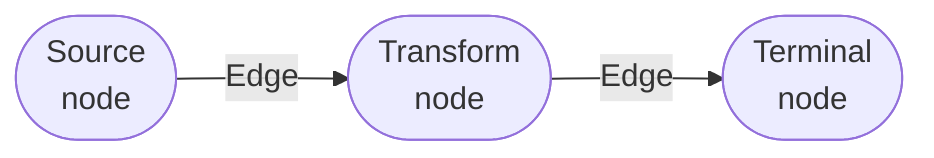

# Getting Started

This guide walks you through building your first yieldgraph pipeline step by step.  By the end you will understand the core data-flow model and be ready to tackle more advanced patterns.

---

## Installation

```bash
pip install yieldgraph
```

To unlock richer structured logging, install the optional `loguru` dependency:

```bash
pip install yieldgraph loguru
```

---

## Anatomy of a pipeline

Every yieldgraph pipeline is made up of three kinds of building blocks:



| Role | Description |
|---|---|
| **Source** | The entry point. Generates or loads raw data. Receives the `Graph` instance as its first argument. |
| **Transform** | Processes items from the previous node and yields results onward. Can yield zero, one, or many items per input. |
| **Terminal** | The last node in a chain. Its outputs are collected in `graph.output` after the run. |

Any node can play any role — the distinction is purely positional.

---

## Your first pipeline

```python
from yieldgraph import Graph

def source(graph):          # (1)!
    for value in [10, 20, 30]:
        yield value

def double(x):              # (2)!
    yield x * 2

g = Graph()
g.add_chain(source, double) # (3)!
g.run()                     # (4)!

print(g.output)
# [(20,), (40,), (60,)]     # (5)!
```

1. The **first** function in a chain always receives the `Graph` instance as its first positional argument.
2. Each subsequent function receives whatever the previous step `yield`s — unpacked as individual arguments.
3. `add_chain` registers the functions and wires up the internal `Edge` queues automatically.
4. `g.run()` executes all nodes in order. No data moves until you call `run`.
5. `g.output` is `List[Tuple[Any, ...]]`. Every yielded value is normalised to a tuple, so a plain `int` becomes a one-element tuple `(int,)`.

---

## Source functions

The source function kicks off the pipeline. It always receives the `Graph` instance as its first argument — useful for inspecting state or previous outputs.

### Static data source

```python
def source(graph):
    for record in [
        {"id": 1, "name": "Alice"},
        {"id": 2, "name": "Bob"},
    ]:
        yield record
```

### File-based source

```python
import csv

def read_csv(graph):
    with open("data.csv", newline="") as fh:
        reader = csv.DictReader(fh)
        for row in reader:
            yield row
```

### API or database source

```python
import sqlite3

def from_database(graph):
    conn = sqlite3.connect("app.db")
    cursor = conn.execute("SELECT id, value FROM measurements")
    for row in cursor:
        yield row          # yields (id, value) tuple
    conn.close()
```

!!! tip "Source with graph.output"
    When chaining multiple pipelines you can feed the output of a previous run into a new source:

    ```python
    def re_process(graph):
        for row in graph.output:   # (1)!
            yield row

    g2 = Graph()
    g2.add_chain(re_process, transform)
    g2.run()
    ```

    1. `graph.output` from any previous run is available here. `graph` is the new Graph instance, so you would pass the previous graph's output differently — see [Patterns & Recipes](patterns.md).

---

## Transform functions

Transform functions sit in the middle of a chain. They receive whatever the upstream node yields (unpacked as `*args`) and yield results downstream.

### One-to-one transform

```python
def to_uppercase(text):
    yield text.upper()
```

### One-to-many transform (expand)

```python
def split_words(sentence):
    for word in sentence.split():
        yield word          # yields each word separately
```

### Many-to-one (filter / aggregate)

```python
def filter_positive(x):
    if x > 0:
        yield x             # skip negatives — yield nothing for them
```

### Stateful transform

```python
def running_total(x):
    # Use a mutable default or a closure for state
    running_total.acc = getattr(running_total, 'acc', 0) + x
    yield running_total.acc
```

!!! note "Yielding nothing is fine"
    If a transform yields nothing for a given input, the pipeline simply skips that item. Use this as a clean filter pattern.

---

## Regular (non-generator) functions

You do **not** need to use `yield`. A plain function that `return`s a value is automatically wrapped into a one-shot generator:

```python
def add_tax(price):
    return price * 1.19     # return, not yield

def format_price(price):
    return f"€ {price:.2f}"

g = Graph()
g.add_chain(source, add_tax, format_price)
g.run()
# g.output → [('€ 11.90',), ('€ 23.80',), ...]
```

The rule is simple: `return` → one result; `yield` → zero or more results.

---

## Multi-argument passing with tuples

When a function yields a **tuple**, the downstream function receives the tuple's elements as separate positional arguments:

```python
def source(graph):
    # Yield pairs of (name, score)
    yield ("Alice", 95)
    yield ("Bob",   80)
    yield ("Carol", 88)

def grade(name, score):             # receives two arguments
    label = "pass" if score >= 85 else "fail"
    yield f"{name}: {label}"

g = Graph()
g.add_chain(source, grade)
g.run()

for row in g.output:
    print(row[0])
# Alice: pass
# Bob: fail
# Carol: pass
```

!!! tip "Single values vs tuples"
    - Yield a **plain value** (`yield x`) → downstream receives `x` as a single argument.
    - Yield a **tuple** (`yield (a, b)`) → downstream receives `a` and `b` as separate arguments.

    This mirrors Python's normal `*args` unpacking.

---

## Multi-step chains

Chain as many functions as you need — there is no limit:

```python
from yieldgraph import Graph
import json

def fetch_raw(graph):
    """Simulate fetching JSON records."""
    raw = [
        '{"id": 1, "temp": 23.5}',
        '{"id": 2, "temp": -999}',
        '{"id": 3, "temp": 21.0}',
    ]
    for line in raw:
        yield line

def parse_json(line):
    yield json.loads(line)

def filter_outliers(record):
    if -50 < record["temp"] < 50:
        yield record

def extract_temp(record):
    yield record["temp"]

def celsius_to_fahrenheit(c):
    yield round(c * 9 / 5 + 32, 1)

g = Graph()
g.add_chain(fetch_raw, parse_json, filter_outliers, extract_temp, celsius_to_fahrenheit)
g.run()

print(g.output)
# [(74.3,), (69.8,)]   ← the -999 outlier was filtered out
```

---

## Reading pipeline output

`g.output` returns a `List[Tuple[Any, ...]]` collected from the **terminal nodes** (the last node of each chain).

```python
g.run()

# Iterate over rows
for row in g.output:
    print(row)

# Unpack single-value tuples
values = [row[0] for row in g.output]

# Check whether the run produced anything
if g.has_output:
    print(f"Pipeline produced {len(g.output)} rows")

# Check for success
if g.succeeded:
    print("Pipeline completed without errors")
else:
    print(f"Pipeline error: {g.error}")
```

---

## Calling the graph as a callable

`Graph` supports `__call__`, so you can invoke it like a function:

```python
g = Graph()
g.add_chain(source, transform)
g()     # equivalent to g.run()
```

---

## Next steps

- [**Patterns & Recipes**](patterns.md) — fan-out branches, error handling, cancellation, threaded mode
- [**Configuration**](configuration.md) — environment variables, logging levels
- [**API Reference**](../api/index.md) — complete class documentation
