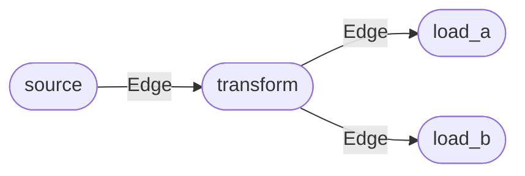

# yieldgraph

> Build interruptible, generator-driven ETL pipelines as directed graphs — in pure Python.

[Get Started](guides/getting-started.md){ .md-button .md-button--primary }
[API Reference](api/index.md){ .md-button }

---

## What is yieldgraph?

**yieldgraph** lets you compose data-processing pipelines by connecting plain Python callables into a directed graph. Each callable becomes a **Node**. Nodes are linked by **Edges** — lightweight queues that carry data tuples downstream. Call `graph.run()` and the pipeline does the rest.

There is no framework to learn. Your business logic stays in ordinary Python functions. yieldgraph just wires them together, manages data flow, and gets out of the way.

---

## Key features

<div class="grid cards" markdown>

- :fontawesome-brands-python: **Pure Python, zero runtime deps**

    ---

    No required third-party dependencies. Add `loguru` for richer logs — everything else is stdlib.

- :material-lightning-bolt: **Generator-native**

    ---

    `yield` multiple results from any step. Everything stays lazy; no intermediate lists unless you ask for them.

- :material-cancel: **Cooperative cancellation**

    ---

    Set `graph.cancelled = True` or press <kbd>Ctrl</kbd>+<kbd>C</kbd> — the pipeline stops cleanly at the next `yield`.

- :material-source-fork: **Fan-out branching**

    ---

    Attach multiple downstream chains to any node with one `add_chain` call.

- :material-thread: **Threaded mode**

    ---

    Flip `YIELDGRAPH_THREADED=1` to run all nodes concurrently. Edges become thread-safe blocking queues automatically.

- :material-chart-line: **Built-in observability**

    ---

    Every node exposes `n_consumed`, `n_produced`, `errors`, and a `progress` fraction you can poll at any time.

</div>

---

## Architecture

A pipeline is a directed graph: data enters at the **source** node and flows through **transform** nodes to one or more **terminal** nodes. Each arrow is an `Edge` queue.



| Class | Role |
|---|---|
| [`Graph`](api/index.md#yieldgraph.graph.Graph) | Owns all nodes and edges. Entry point for building and running a pipeline. |
| [`Node`](api/index.md#yieldgraph.node.Node) | A single processing step. Pulls from incoming edges, runs its job, fans results to outgoing edges. |
| [`Job`](api/index.md#yieldgraph.job.Job) | Wraps a callable. Normalises plain functions and generators into a uniform, cancellable generator protocol. |
| [`Edge`](api/index.md#yieldgraph.edge.Edge) | A `deque`-based directed queue. Thread-safe `put`/`get` in threaded mode; plain `append`/`popleft` in sequential mode. |

---

## Installation

```bash
pip install yieldgraph
```

## Quick start

```python
from yieldgraph import Graph

# --- Define pipeline steps as plain Python functions ---

def source(graph):          # (1)!
    """Emit raw integers."""
    for i in range(1, 6):
        yield i

def square(x):              # (2)!
    """Square each number."""
    yield x ** 2

def as_string(x):           # (3)!
    """Format as a labelled string."""
    yield f"result={x}"

# --- Build and run ---

g = Graph()
g.add_chain(source, square, as_string)
g.run()

# --- Consume results ---

for row in g.output:
    print(row)

# ('result=1',)
# ('result=4',)
# ('result=9',)
# ('result=16',)
# ('result=25',)
```

1. The **first** node always receives the `Graph` instance as its first argument.
2. Subsequent nodes receive whatever the previous node `yield`s — unpacked as `*args`.
3. Each yielded value is normalised to a tuple, so `g.output` is always `List[Tuple[Any, ...]]`.

---

## Next steps

- [**Getting Started**](guides/getting-started.md) — step-by-step tutorial covering sources, transforms, and outputs
- [**Patterns & Recipes**](guides/patterns.md) — fan-out branches, error handling, cancellation, threaded mode
- [**Configuration**](guides/configuration.md) — environment variables and logging
- [**API Reference**](api/index.md) — full class and method documentation
